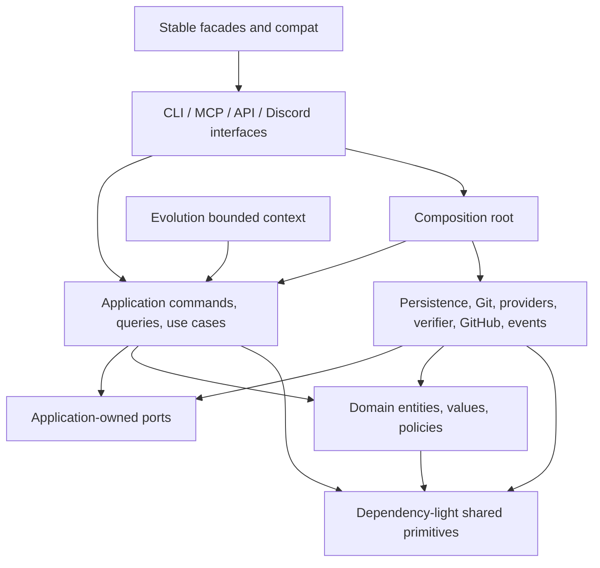

# Dependency Boundary

## Target Compile-Time Direction

Arrows represent allowed compile-time imports. Runtime control may flow from an application use case through a port to an infrastructure adapter, but the adapter implements an inward-owned contract.

## Forbidden Edges

- domain -> application, infra, interfaces, compat, root facades, providers, MCP, CLI
- application -> infra, interfaces, compat, root implementation facades
- infra -> interfaces or compat
- evolution -> concrete infra adapters or lifecycle mutation surfaces
- stable facades -> concrete persistence/provider implementations
- any cross-boundary import cycle

## Current-To-Target Ownership

| Current responsibility | Target owner |
| --- | --- |
| task defaults and lifecycle invariants mixed into repository code | domain task aggregate and policies |
| task/agent JSON read-write under `domain/*/repository.py` | infra persistence adapters |
| planning/workflow orchestration importing root modules | application use cases |
| lifecycle evaluation importing public planning facade | pure domain lifecycle policy |
| Git/worktree helpers in root modules | infra workspace/version-control adapters |
| provider wrapper importing CLI handler | infra provider adapter called through application port |
| verification policy and command execution mixed | domain/application policy plus infra verifier |
| promotion policy, Git, GitHub, and receipts in one service | domain policy, application use case, infra Git/GitHub/artifact adapters |
| CLI/MCP service importing many concrete functions | interface adapters calling application facade |
| evolution direct repository reads/writes | application queries and append-only artifact/evaluation ports |

## Enforcement

An AST architecture test records every internal import edge. During migration it permits only a shrinking, owner-tagged baseline allowlist. Final verification requires no forbidden edge, no cross-boundary strongly connected component, and no facade implementation exemption.
