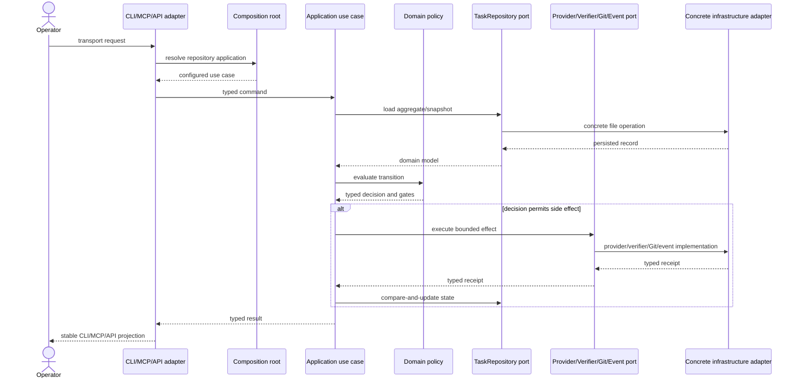
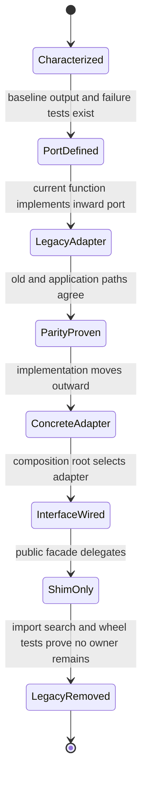

# Migration And Runtime Sequence

## Target Runtime Sequence

## Per-Use-Case Cutover

No use case skips the characterization, parity, or shim stages. Persisted schema changes are outside this sequence and require a separate approved task.

## Failure Ordering

Application use cases must make effect order explicit. A state update that records an external effect occurs only after a typed receipt is returned. Retry paths inspect existing state/receipts before repeating commit, push, PR, verification, or event operations. Failure-injection tests stop after each boundary and compare the resulting task record and artifacts to the baseline contract.
