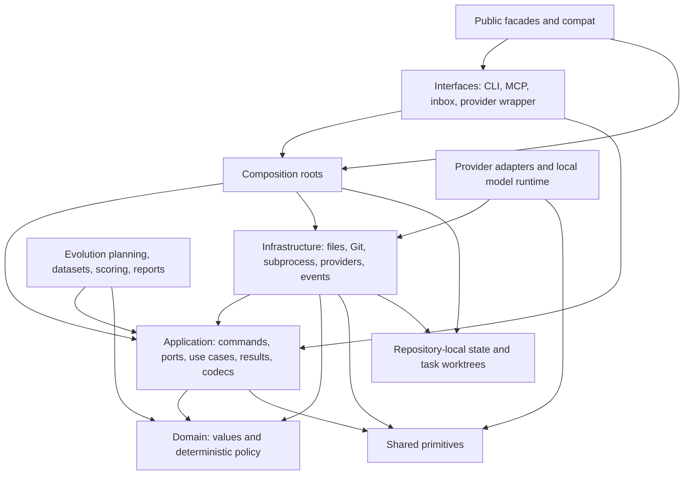
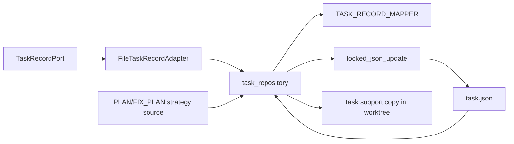
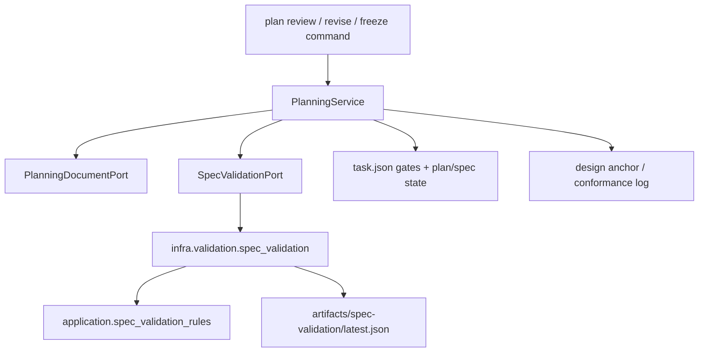
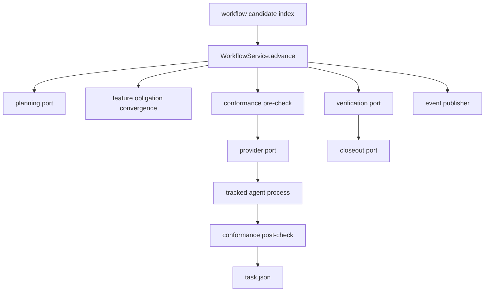
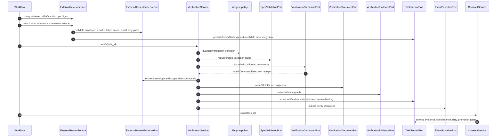
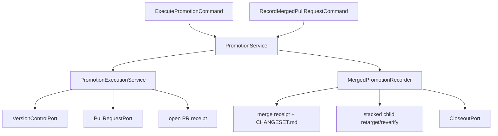
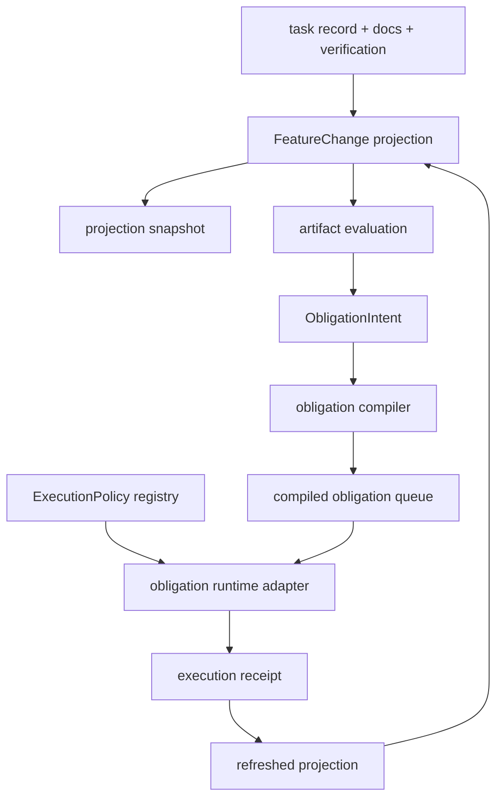

# Architecture And Data Pipeline

Last verified against code: 2026-07-20

This document maps the implemented Sisyphus package boundaries to the data that
crosses them. It describes current code, not a target service decomposition.

## 1. Dependency Topology



The two arrows from infrastructure to application and domain mean adapter
implementations depend on inward-owned contracts and values. They do not mean
inner layers call concrete infrastructure.

## 2. Layer Contract

| Layer | Input form | Output form | May perform effects |
| --- | --- | --- | --- |
| interface | CLI args, MCP payload, inbox JSON, provider args | commands, response projections, exit codes | transport only |
| composition | repository root, config, adapter factories | constructed application service | construction only |
| application | typed command or query plus ports | typed result, state mutation through ports | only through ports |
| domain | values and policy snapshots | decisions, normalized values, gates | no |
| infrastructure | application port calls | persisted records, process receipts, Git/provider results | yes |
| compatibility facade | legacy Python call/import | canonical function or type | delegation or centralized legacy-method installation only |

Architecture guards enforce:

- domain imports only domain/shared, except two import-only repository shims
- application imports only application/domain/shared
- interfaces do not import infrastructure
- the internal import graph is acyclic
- facades do not regain implementation behavior
- canonical model sources do not own boundary serialization methods

## 3. Primary Data Contracts

| Contract | Canonical owner | Boundary representation |
| --- | --- | --- |
| task and agent entities | `domain/task`, `domain/agent` | dataclasses and policy values |
| application requests | `application/commands` | frozen command dataclasses |
| application outcomes | `application/results` | frozen result dataclasses |
| external effects | `application/ports` | narrow protocols |
| task/agent persisted records | `infra/persistence/*_mapper.py` | extension-preserving JSON objects |
| inbox payloads | `interfaces/inbox` | strict exact-type JSON objects |
| artifact and event payloads | `application/codecs` | explicit versioned mappings |
| provider and benchmark receipts | `providers/codecs.py` | explicit mappings |
| lifecycle and conformance | `domain/lifecycle`, `application/*_records.py` | policy values plus persisted gate records |

No canonical model definition declares `to_dict`, `from_dict`, `to_json`, or
`from_json`. A codec or repository mapper owns every wire shape. Stable public
facades use `compat.serialization.install_serialization_compat` to restore the
previous methods on published classes, with each method delegating to the same
canonical codec.

## 4. Request And Task-Creation Pipeline

```mermaid
sequenceDiagram
    autonumber
    actor Client
    participant Surface as CLI / MCP / API
    participant Compose as composition.repository_requests
    participant Request as RepositoryRequestService
    participant Queue as InboxQueueService
    participant Parser as interfaces.inbox
    participant Inbox as InboxRepository
    participant Process as InboxProcessingService
    participant Handler as ConversationEventService
    participant Create as TaskWorkspaceCreationService
    participant Workspace as infra.task_creation
    participant Tasks as FileTaskRecordAdapter

    Client->>Surface: request payload
    Surface->>Compose: repository root + request
    Compose->>Request: typed QueueConversationCommand
    Request->>Queue: queue_conversation
    Queue->>Parser: strict validation and record projection
    Queue->>Inbox: atomic enqueue to pending
    Request->>Process: process queued path
    Process->>Inbox: claim pending into processing
    Process->>Parser: validate persisted record again
    Process->>Handler: dispatch conversation event
    Handler->>Create: CreateTaskRecordCommand
    Create->>Workspace: create branch, worktree, task directory
    Create->>Tasks: save task.json
    Create->>Workspace: materialize task templates
    Handler->>Tasks: save source/provider/owned-path metadata
    Process->>Inbox: complete to processed or fail to failed
```

Effect order is intentional:

1. Queue input is parsed before persistence.
2. A claimed file is parsed again before dispatch.
3. Worktree creation precedes task-directory persistence.
4. Template failure triggers workspace rollback.
5. A new task always starts at plan review; requested auto-run cannot bypass plan
   approval or spec freeze.

Inbox lifecycle directories are:

```text
.planning/inbox/pending
.planning/inbox/processing
.planning/inbox/processed
.planning/inbox/failed
```

Malformed or unsupported events are normalized, bounded, and quarantined without
stopping later events.

## 5. Task Persistence Pipeline



Read behavior:

- validate JSON object shape
- decode and re-encode through `TASK_RECORD_MAPPER`
- preserve unknown fields and omitted mapped fields
- apply legacy defaults and terminal-state normalization
- project structured test strategy from `PLAN.md` or `FIX_PLAN.md`
- remember the loaded file modification time for stale-save detection

Write behavior:

- acquire the repository file lock
- reject a stale loaded instance when the file changed concurrently
- normalize defaults and strategy
- write a temporary file, fsync it, atomically replace the target, and fsync the
  parent directory
- mirror task support files into an existing task worktree

Agent records use the same ownership model through `agent_mapper.py` and
`agent_repository.py`.

## 6. Planning And Spec-Validation Pipeline



The application rule module receives preloaded document projections and
prerequisite records. It knows nothing about `Path`, file reads, or JSON. The
infrastructure adapter owns containment, source fingerprints, stale report
detection, report persistence, and task-state updates.

Plan approval, spec freeze, and plan-change decisions remain operator gates.

## 7. Workflow And Agent-Execution Pipeline



The candidate index is a rebuildable scheduling hint. `WorkflowService` and the
task record remain authoritative. Automatic advancement stops for closed tasks,
disabled auto-loop, plan review, `needs_user_input`, `promotion_pending`, and
`retarget_required`.

For a queued subtask, the service saves the pre-check, emits events, marks the
subtask in progress, invokes the provider port, records the post-check, updates
subtask status, and pauses on process failure or red conformance.

Provider launch details are split across:

- application agent launch and execution services
- `infra/providers` launch and receipt adapters
- `interfaces/provider_wrapper` argument parsing
- `providers/local_agent.py` for the bounded local-model loop
- `infra/workspace` for contained reads, writes, tests, and patch application

## 8. Verification, Evidence, And Closeout Pipeline



Command parsing rejects multiline and NUL input. The shell adapter bounds output,
kills timed-out process groups, and returns typed receipts. The application
service owns gate order and saves retryable state before publishing completion.
VERIFY Markdown is a pure projection in `application/verification_projection.py`.

When a frozen strategy requires an external LLM review,
`ExternalReviewService` is the only status-recording path. The command accepts
only a task ID and a JSON envelope path under that task's
`artifacts/reviews/` directory. The adapter strictly parses the envelope,
derives reviewer, findings, and pass/fail status from its contents, verifies the
bounded no-follow Markdown report and both SHA-256 digests, and binds it to the
exact Git HEAD plus a normalized task/spec/verification-policy scope digest.
That digest includes the immutable integration-base commit, a digest of the
configured fetch URL, and a canonical digest of every effective push URL. When
a remote exists, the adapter performs a bounded,
non-interactive live remote query and does not trust a stale tracking ref. A
configured remote that cannot be queried, or whose push destination cannot be
resolved, blocks review evidence collection.
Only the two review artifacts may be dirty when a review is recorded.

Recording any new review atomically invalidates prior verification and marks
promotion for re-verification. Verification re-inspects the envelope before and
after configured commands, permits only the review files and exact service-owned
`task.json` mutation, and records a binding to the envelope, report, HEAD, and
scope digests only on success. Promotion performs one more evidence inspection,
allows only the exact review and verification output files, skips staging, and
pushes the reviewed commit itself. Any new implementation path blocks promotion
and requires review and verification again. Closeout and promotion reject a
missing or stale binding. MCP recording additionally requires
`SISYPHUS_OPERATOR_CAPABILITY`; the capability input is not persisted in episode
traces. PLAN synchronization
preserves runtime review evidence
only while the frozen required/provider/purpose/trigger policy is unchanged;
any policy change invalidates the evidence back to `pending`.

Closeout does not infer success from an agent claim. It requires canonical verify
state, evidence and conformance gates, worktree policy, and repository promotion
when the task requires it. Git inspection errors produce a dedicated blocking
gate and cannot be converted to a clean result or bypassed by `allow_dirty`.

## 9. Repository Promotion Pipeline



The stable public promotion entrypoints and result shapes remain unchanged.
Execution and merge recording are separate commands, and composition injects
the review-evidence adapter used by execution. Receipt and changeset shapes are
pure projections in `application/promotion_projection.py`.

For ordinary tasks, durable phases are saved after commit, push, and PR creation.
Those control-state saves do not mirror task support files into the worktree
being promoted, so retry metadata cannot become a second source commit.
For externally reviewed tasks, execution refuses to stage workspace changes and
pushes the already-reviewed HEAD before PR creation. Merge recording writes the
receipt and changeset, persists promotion state, optionally attempts close, then
marks open stacked children for retarget and reverify.

Promotion retries distinguish an old pushed phase from a commit created in the
current attempt. A new commit is always pushed, and a commit completed before a
failed state save is recovered from the actual workspace HEAD. Exact task-state
and receipt changes are classified as control output rather than source work.
After a durable push, the pull
request adapter searches for an existing open PR for the exact head/base pair;
this makes an ambiguous create response or a later task-save failure retryable
without duplicate PRs. Durable open-PR state also regenerates a missing final
execution receipt.

## 10. Artifact And Obligation Pipeline



Artifact/DSL values live in `domain/artifact`. Pure projection, evaluation,
snapshot decisions, obligations, and execution-policy selection live in
`application/artifacts`. Packaged declarations and repository IO live in
`infra/artifacts`. Codecs own every persisted artifact shape.

Compiled obligation identity includes the materialized input fingerprint. Input
drift creates a new obligation instance or stale-input repair path rather than
silently reusing an old verdict.

## 11. Search And Observation Pipeline

Task docs, persisted snapshots, verification claims, and event evidence are
projected into application-owned `SearchDocument` values. Infrastructure owns
JSONL indexing and contained ContextPack persistence. CLI and MCP call composed
search services. The current task is excluded from its own execution ContextPack.

Observation combines task, lifecycle, conformance, document, verification,
evidence, subtask, and promotion projections. It returns explicit
`allowed_next_actions` and `forbidden_next_actions`; it does not mutate state.

## 12. Evolution Pipeline And Authority

```mermaid
flowchart LR
    Read["read-only task/event ports"]
    Dataset["EvolutionDataset"]
    Harness["effect-free evaluation plan"]
    Materialize["infra evolution materializer"]
    Execute["infra command runner"]
    Score["constraints + fitness"]
    Report["append-only run report"]
    Followup["request-only follow-up command"]
    Control["normal Sisyphus lifecycle"]

    Read --> Dataset
    Dataset --> Harness
    Harness --> Materialize
    Materialize --> Execute
    Execute --> Score
    Score --> Report
    Report --> Followup
    Followup --> Control
```



`evolution/harness.py` owns plans, metrics, evidence requests, and worktree
command projection. Worktree mutation and process execution live in
`infra/evolution`; task creation, approval, freeze, and provider sequencing are
owned by control-side composition. Evolution run storage is append-only and
bounded. Evaluation commands share the infrastructure bounded-shell adapter with
verification: each command has a deadline, per-stream output tails, truncation
counts, process-group termination, and an explicit timeout/error receipt.

Evolution may recommend or request. It may not approve, freeze, verify, activate,
close, or promote canonical state.

## 13. Security And Durability Boundaries

- repository-relative paths are normalized and checked for containment
- descriptor-relative workspace files reject symlink traversal and leaf swaps
- task support-file mirrors reject unsafe document paths and use bounded,
  descriptor-relative no-follow reads plus atomic target replacement
- Git patch application compares tree hashes before and after execution
- review scope binds HEAD, the live-remote integration-base commit, and remote identity
- generated verification/promotion outputs cannot overlap task authority inputs
- closeout treats unavailable Git status as a non-overridable blocking gate
- artifact and evolution stores reject unsafe IDs and symlinked targets
- inbound parsers enforce exact scalar/container types, limits, and JSON budgets
- provider receipts are bounded and can be bound to request digests
- atomic writers fsync file contents and parent directories
- JSONL appenders lock, avoid following the leaf, and fsync durable appends
- subprocess adapters use argument lists or strict single-line parsing, bounded
  output, timeouts, and process-group termination

## 14. Compatibility And Remaining Debt

Public facades preserve import and monkeypatch behavior while implementations
move inward or outward. Serialization facades may install only codec-delegating
legacy methods through the centralized compatibility helper. The only allowed
domain outward edges are:

```text
domain/agent/repository.py -> infra/persistence/agent_repository.py
domain/task/repository.py  -> infra/persistence/task_repository.py
```

Both are import-only and preserve canonical symbol identity. See
[clean-architecture-implementation-debt.md](./clean-architecture-implementation-debt.md)
for retirement conditions and release gates.

The separate Sisyphus Harness Hermes/GEPA/30.5B benchmark program is outside this
repository migration and must not be inferred from these runtime pipelines.

## 15. Implementation Anchors

Documentation conformance tests require these current ownership anchors to exist
and remain named here:

- `application/use_cases/workflow.py`
- `application/use_cases/verification.py`
- `application/use_cases/promotion_execution.py`
- `application/use_cases/promotion_merge.py`
- `application/spec_validation_rules.py`
- `composition/repository_requests.py`
- `composition/evolution_evaluation.py`
- `infra/persistence/task_records.py`
- `infra/persistence/record_mapper.py`
- `infra/validation/spec_validation.py`
- `domain/agent/repository.py`
- `domain/task/repository.py`

The list is deliberately small. It guards authority boundaries and the two
compatibility exceptions without making every internal filename a documentation
API.
