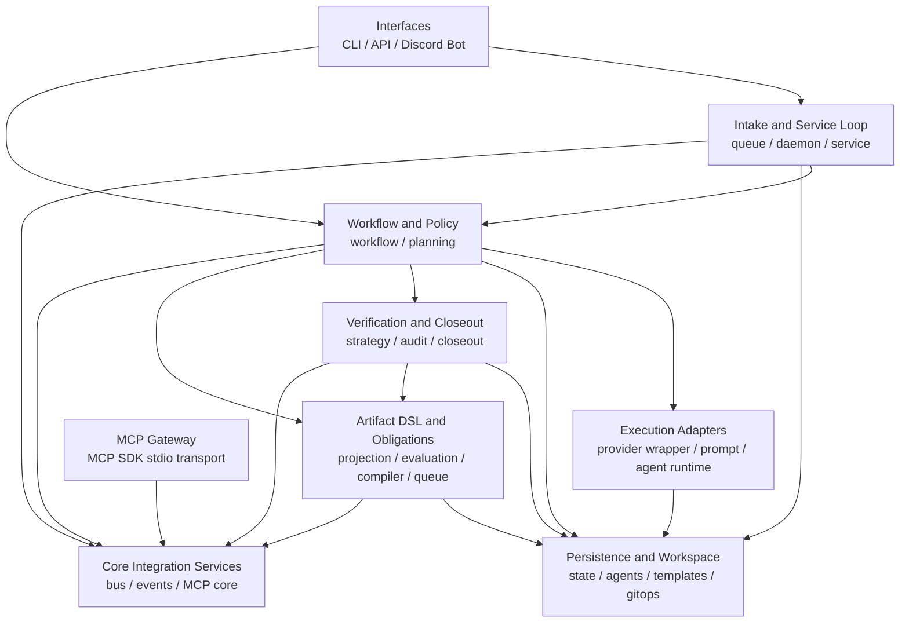
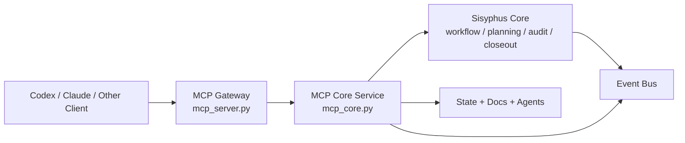
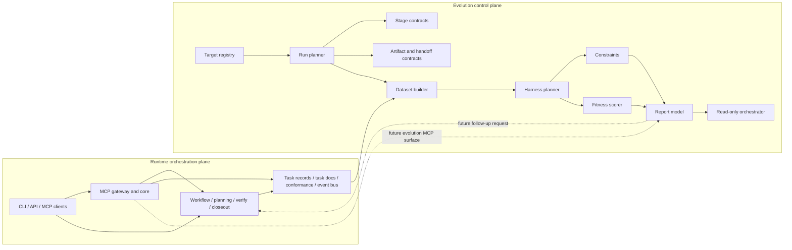
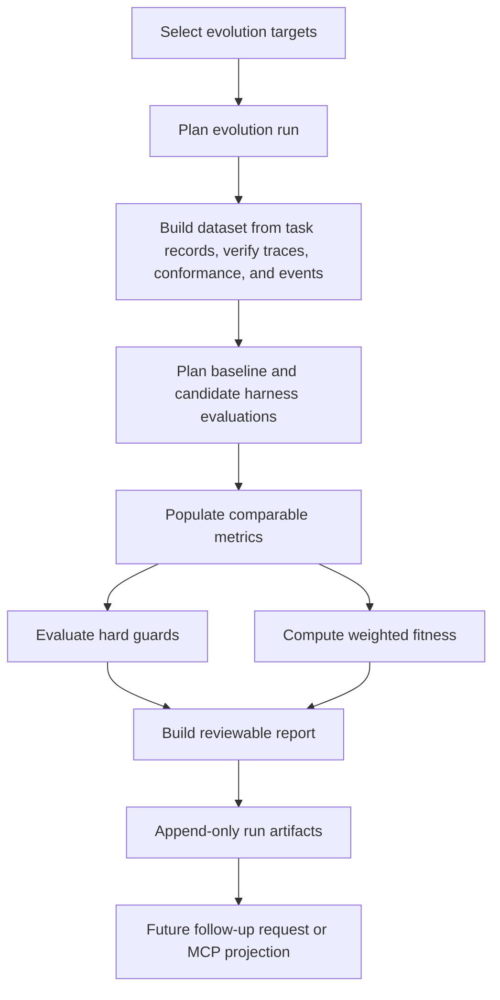
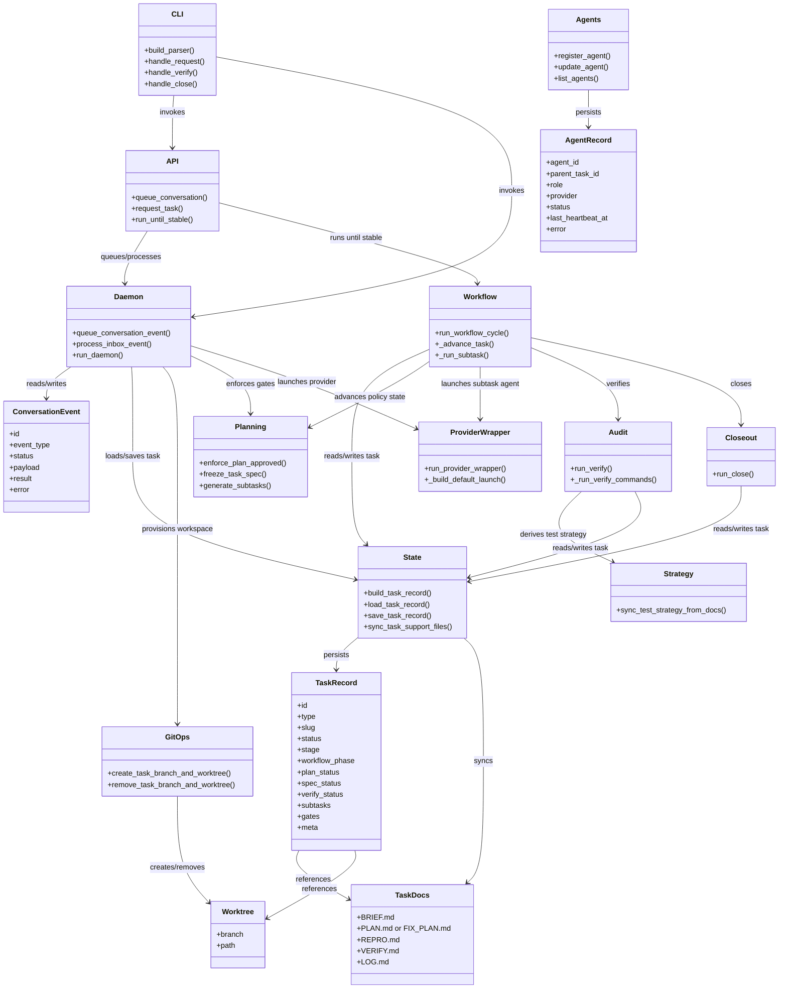
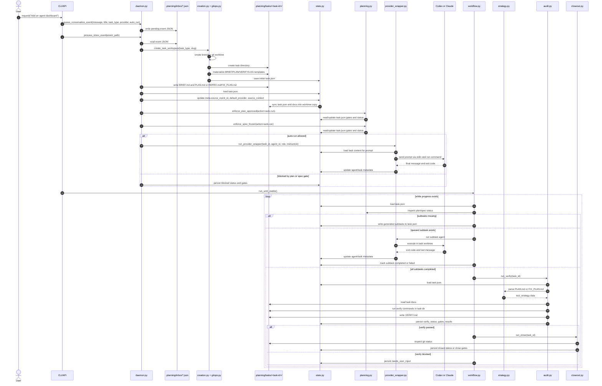

# Sisyphus Architecture

This document describes the current architecture of Sisyphus as of 2026-04-26.

Sisyphus is a graph-native work system that runs inside a target Git repository and manages repository-local work state, task documents, worktrees, execution, verification, and closeout.

Its center is not an agent, a chat session, or a flat task list. The center is a controlled work world composed of specs, artifacts, typed relations, verification evidence, promotion state, invalidation state, and execution receipts. Intelligence is allowed to act on that world, but it is not allowed to become the authority over that world.

## Core Purpose

Sisyphus should be understood as:

> a graph-native work system centered on a controllable work world, with intelligence gradually internalized as operations over that world

This means:

- the authoritative state lives in durable, reviewable repository artifacts
- runtime intelligence is an operator over that state rather than the source of truth
- reconstructability matters as much as execution convenience

The task runtime is still the operator-facing control surface, but feature work now passes through an artifact projection, DSL, obligation queue, and convergence loop before verification and promotion decisions are considered closed.

For visual diagrams of the current task runtime, artifact-governed feature-change path, target artifact authority, and adapter boundaries, see [runtime-relationship-diagrams.md](./runtime-relationship-diagrams.md).

## Hard State And Soft Cognition

The architecture separates two categories of system responsibility.

### Hard State

Hard state is the durable truth the system must be able to recover, validate, diff, and promote.

- spec artifacts
- produced artifacts
- typed edges and slot bindings
- verification claims and evidence
- promotion decisions
- invalidation state
- execution receipts

### Soft Cognition

Soft cognition improves throughput and adaptability, but it must not replace durable state.

- planning
- decomposition
- scheduling
- impact analysis
- retry and recovery strategy
- replanning
- semantic review
- context condensation

The governing rule is:

> intelligence may be internalized, but it must not overwrite or bypass hard-state authority

## Task And Artifact Model

Tasks are still first-class, but they are not the primary durable object. Artifacts carry durable state. Tasks are operators that produce, transform, or compose artifacts.

The intended model is:

- `TaskSpec`: the planned operation
- `TaskRun`: the executed operation and its receipt
- `Artifact`: a durable state object
- `CompositeArtifact`: a higher-order artifact whose validity depends on typed relationships among child artifacts
- `VerificationArtifact`: evidence for a specific claim
- `ArtifactPromotionDecision`: the recorded decision that an artifact obligation is closed or blocked
- `RepositoryPromotionExecution`: the branch, commit, push, and pull-request execution path that publishes verified repository work

This implies two important boundaries:

- `TaskSpec` and `TaskRun` must remain distinct
- higher-order results are not loose bundles; they are contract-bearing composite objects

## Composite Artifacts And Reconstruction

A higher-order artifact exists only when the system can recover:

- which child artifacts participated
- which task specs and task runs produced them
- which typed edges and slot bindings connected them
- which composition rule made the result valid
- which verification claims supported the result
- which promotion state the result currently holds

For that reason, a final artifact should be understood as having two layers:

- `payload`: the usable result
- `envelope`: the reconstructable composition record explaining why the result is valid

This reconstructability requirement is stronger than simple lineage tracking. It is a design constraint for persistence, verification, invalidation, and promotion.

## Artifact DSL And Obligation Runtime

The first implemented artifact-governed slice is the `FeatureChangeArtifact` protocol.

The authoritative DSL boundary is intentionally about meaning, not provider selection:

- `ProtocolSpec` defines the artifact type, slots, invariants, required claim scopes, and obligation specs.
- `ObligationSpec` defines reusable obligation templates.
- `InputContract` defines the evidence boundary for an obligation: required, optional, forbidden, and closure rules.
- `ObligationIntent` is the runtime signal emitted by evaluation for the current world state.
- `CompiledObligation` is the executable obligation instance after current slots are bound to concrete artifact refs.
- `MaterializedInputSet` records the concrete input refs and fingerprint used by a compiled obligation.
- `ExecutionPolicy` is a replaceable overlay that chooses the runner, role, provider, tool, timeout, retry, or budget.

The key boundary is:

> what to read, what to produce, and what to verify is DSL authority; who or what executes it is execution policy

Feature-change DSL declarations live in packaged JSON so the protocol is data-declared instead of hard-coded:

- `src/sisyphus/declarations/feature_change_protocol.json`
- `src/sisyphus/declarations/execution_policies.json`

At runtime, evaluation emits `ObligationIntent` records, the compiler binds them through `slot://` selectors into concrete `artifact://` refs, and the daemon materializes a compiled queue at:

```text
.planning/tasks/<task-id>/artifacts/obligations/compiled.json
```

The queue stores the protocol declaration, execution policy registry, evaluation result, intents, compiled obligations, materialized input fingerprints, statuses, and execution receipts. Existing obligation state is preserved by `(obligation_id, input_fingerprint)`, so changing inputs naturally creates a new obligation instance instead of mutating the meaning of a previous one.

## Verification, Promotion, And Invalidation

Verification is not a generic boolean. It is proof for a claim over a scope with explicit dependencies and evidence.

The system should reason about verification in three layers:

- `local`: an artifact is internally valid
- `cross`: relationships between artifacts are valid
- `composite`: a higher-order artifact satisfies its intended obligation

Higher-layer verification is not implied by lower-layer verification.

Promotion is likewise not task completion. Artifact promotion is obligation closure for an artifact. A promoted artifact should have:

- required slots filled
- invariants satisfied
- required verification claims passed
- no stale dependencies
- no unresolved conflicts
- required approvals or evidence recorded

Invalidation must precede operational change requests. When an input changes, the system first computes which composites or verification claims are stale, and only then decides whether to reverify, reassemble, replan, or issue a new change request.

Repository promotion is a separate execution layer. `promotion.py` handles commit, push, PR, merge receipt, and changeset recording through `RepositoryPromotionExecution` and merge receipt outcomes. Artifact promotion decisions and repository promotion execution are connected, but they are not the same concept.

## Authority Boundary For Intelligence

Hermes-like agent runtimes remain useful, but they must stay outside the authoritative state boundary.

Those runtimes usually carry hidden state through:

- session accumulation
- memory injection
- summarization or compression
- fallback and retry policy
- autonomous loop decisions

That is useful for general-purpose agent behavior, but it introduces drift if treated as the runtime authority.

The architectural rule is therefore:

- Sisyphus owns the authoritative runtime contract
- external or embedded agent intelligence remains an optional cognition module
- hard-state persistence, receipts, verification, promotion, and invalidation stay inside Sisyphus

## Implemented Design Lock

The first concrete protocol is now the feature-change composite. Common composition kernels and reusable graph machinery should be extracted only after this protocol continues to survive real task, verification, invalidation, and promotion pressure.

### Feature-Change Protocol

The locked first protocol is a repository-change composite for feature delivery.

The protocol description lives in [docs/feature-change-artifact.md](./feature-change-artifact.md), and the executable declaration lives in `src/sisyphus/declarations/feature_change_protocol.json`.

One practical shape is:

- `FeatureChangeArtifact`
  - `spec` slot
  - `implementation_candidates[]` collection slot
  - `selected_implementation` slot
  - `test_obligations[]` collection slot
  - `verification_claims[]` collection slot
  - optional `approvals[]` collection slot

This is the right first candidate because it matches the repository's current workflow shape while still forcing the system to define:

- role-based slots and collection slots
- cross-artifact invariants such as spec or implementation compatibility
- layered verification from local checks to composite acceptance
- promotion rules for when a change is actually ready
- invalidation behavior when spec, implementation, or tests move independently
- a reconstructable envelope that can later map to branch, PR, and merge decisions

### Current Feature-Change Pipeline

```text
Task record + task docs
-> project_feature_task_record()
-> persisted artifact snapshot
-> evaluate_feature_task_projection()
-> ObligationIntent
-> compile_feature_change_obligations()
-> compiled obligation queue
-> converge_feature_change_obligations()
-> verify execution receipts and refreshed projection snapshot
```

The persisted snapshot lives at:

```text
.planning/tasks/<task-id>/artifacts/projection/feature-change.json
```

Snapshot fingerprints allow the daemon to detect stale projected inputs. When a persisted feature-change snapshot no longer matches the current projection, the obligation runtime emits a `reverify_stale_inputs` intent and recompiles a repair obligation against the current bound inputs.

## System Shape

At a high level, the current implementation is organized as a layered orchestration stack:

```text
+------------------------------------------------------------------+
| Layer 1. Interfaces                                               |
| CLI commands, Python API, Discord bot, MCP clients                |
| src/sisyphus/cli.py, api.py, discord_bot.py                       |
+------------------------------------------------------------------+
| Layer 2. Intake and Service Loop                                  |
| Conversation queue, inbox processing, daemon/service loop         |
| src/sisyphus/daemon.py, service.py                                |
+------------------------------------------------------------------+
| Layer 3. Workflow and Policy                                      |
| Workflow transitions, plan/spec gates, subtask generation         |
| src/sisyphus/workflow.py, planning.py                             |
+------------------------------------------------------------------+
| Layer 4. Execution Adapters                                       |
| Provider wrappers, prompt assembly, tracked agent runtime         |
| src/sisyphus/provider_wrapper.py, codex_prompt.py, agent_runtime.py |
+------------------------------------------------------------------+
| Layer 5. Persistence and Workspace                                |
| Task JSON, agent JSON, task docs, templates, git worktrees        |
| src/sisyphus/state.py, agents.py, templates.py, gitops.py         |
+------------------------------------------------------------------+
| Layer 6. Verification and Closeout                                |
| Strategy extraction, audits, verify commands, close gates         |
| src/sisyphus/strategy.py, audit.py, closeout.py                   |
+------------------------------------------------------------------+
| Layer 7. Artifact DSL and Obligation Runtime                      |
| Artifact records, projection snapshots, evaluation, DSL compiler  |
| src/sisyphus/artifacts.py, artifact_projection.py, dsl.py         |
| src/sisyphus/feature_change_dsl.py, obligation_runtime.py         |
+------------------------------------------------------------------+
| Layer 8. Core Integration Services                                |
| Event bus, MCP core service, shared adapter logic                 |
| src/sisyphus/bus.py, bus_jsonl.py, events.py, mcp_core.py         |
+------------------------------------------------------------------+
| Layer 9. MCP Gateway                                              |
| Official MCP SDK stdio gateway, tool/resource binding             |
| src/sisyphus/mcp_server.py                                        |
+------------------------------------------------------------------+
```

## Layer Diagram

The main dependency flow is downward. Upper layers coordinate lower layers and should not contain low-level persistence details unless needed for orchestration.



## MCP Boundary

MCP is the shared product interface for Codex, Claude, and any future agent client. To keep that interface stable while the orchestration core evolves, the codebase now treats MCP as a thin gateway over a repo-local core service.



The intended responsibilities are:

- `mcp_server.py`: official MCP Python SDK server, stdio transport, tool/resource binding.
- `mcp_core.py`: repo-aware tool/resource resolution and response shaping.
- `bus.py` and related modules: publication surface for visualization, monitoring, and other apps.
- sisyphus core modules: workflow, conformance, verification, and persistence policy.

## Evolution Control Plane

The repository now also contains a separate read-only evolution control plane in [`src/sisyphus/evolution/`](../src/sisyphus/evolution/). This subsystem is intentionally adjacent to the live orchestration workflow rather than embedded inside it.

The current implemented slices are:

- target registry and run planning in `targets.py` and `runner.py`
- stage and failure contracts in `stages.py`
- artifact-cycle and handoff contracts in `artifacts.py` and `handoff.py`
- dataset extraction from task records, conformance state, verify metadata, and event logs in `dataset.py`
- baseline/candidate harness planning, isolated evaluation execution, and worktree-backed receipt capture in `harness.py`
- bounded baseline/candidate materialization in `materialization.py`
- hard-guard evaluation and weighted scoring in `constraints.py` and `fitness.py`
- stable reporting projection in `report.py`
- read-only orchestration and append-only run persistence in `orchestrator.py`
- read-only CLI views in `cli.py` backed by `evolution/surface.py`

The following pieces are still future work:

- follow-up task handoff into the Sisyphus lifecycle
- richer MCP evolution tools/resources beyond the current read surfaces
- broader artifact protocols beyond feature-change
- agent/tool execution policies beyond the current local verifier runner

### Evolution Authority Boundary

The control-plane boundary is strict:

- evolution owns planning, candidate comparison, guard evaluation, fitness scoring, and report generation
- evolution may write append-only run artifacts under `.planning/evolution/runs/<run_id>/`
- evolution must not mutate live repository state, live task state, approval state, or promotion state
- Sisyphus owns task creation, plan review, spec freeze, provider execution, verification, receipts, promotion, and invalidation

In practical terms, an evolution run may recommend or request a follow-up task, but it may not approve, freeze, verify, or promote its own result.

### Evolution System Diagram



### Evolution Evaluation Loop



Today this loop is implemented as a planning and evaluation model layer through the read-only orchestrator, bounded candidate materialization, and full worktree-backed harness execution inside isolated evaluation worktrees. It still does not land approved results through the normal Sisyphus lifecycle.

## Class Diagram

The following diagram shows the main runtime objects and persistent artifacts, with emphasis on where data is stored and how it moves between modules.



## Core Responsibilities

### 1. Interfaces

The interface layer exposes the system to operators and automation.

- `cli.py` defines command entrypoints such as `request`, `ingest`, `daemon`, `serve`, `verify`, `close`, `plan`, `spec`, and `agents`.
- `api.py` provides a library-facing wrapper around queueing, processing, and running the workflow until stable.
- `discord_bot.py` is an optional external integration path that feeds the same orchestration model.

This layer should stay thin. It is mostly argument parsing, command dispatch, and result presentation.

### 2. Intake and Service Loop

This layer converts a user request into repository-local events and drives the orchestration loop.

- `daemon.py` serializes conversation requests into inbox event JSON files.
- The daemon processes pending events, creates tasks, and moves events into processed or failed inbox folders.
- `service.py` wraps the daemon loop and can emit task notifications based on state changes.

This is the operational backbone of the system. It separates request intake from workflow advancement.

### 3. Workflow and Policy

This layer contains the orchestration rules for task progression.

- `workflow.py` advances tasks through plan approval, spec freeze, subtask generation, subtask execution, verification, and closeout.
- `planning.py` defines plan and spec status rules, plan review rounds, and blocking gates.

This layer acts as the state machine, even though it is implemented as direct field transitions rather than a formal state machine framework.

### 4. Execution Adapters

This layer is the boundary between Sisyphus and external coding agents.

- `provider_wrapper.py` normalizes launch modes and constructs the default provider command.
- `codex_prompt.py` builds the prompt for Codex execution in the task worktree.
- `agent_runtime.py` runs tracked agents and updates their lifecycle state.
- `wrappers/codex/run.py` and `wrappers/claude/run.py` are small provider launch shims.

This layer is intentionally adapter-shaped. The orchestration logic does not need to know the full mechanics of each provider.

### 5. Persistence and Workspace

This layer stores state and provisions task workspaces.

- `state.py` defines the task record shape and persists task JSON.
- `agents.py` tracks per-agent lifecycle as JSON files with heartbeat-based status derivation.
- `templates.py` materializes task document templates into the task directory.
- `gitops.py` creates and removes task branches and worktrees.
- `creation.py` combines task record creation, worktree setup, and rollback behavior.

This is a file-first architecture. The source of truth is repository-local state, not an external database.

### Task Worktree Baseline Rule

Task worktrees are provisioned from the configured `base_branch`, not from the current root worktree's dirty state.

- `creation.py` calls `gitops.create_task_branch_and_worktree()`.
- `gitops.create_task_branch_and_worktree()` runs `git worktree add -b <branch> <target> <base_ref>`.
- `base_ref` is resolved from `config.base_branch` by `gitops.resolve_base_ref()`.

That means an in-progress root worktree migration or refactor is not automatically present in a newly created task worktree. The only supported escape hatch is direct-change adoption:

- `daemon.py` can apply `adopt_current_changes` during task creation.
- adoption copies the current root dirty paths into the new task worktree and records the overlay in `task.json -> meta.adopted_changes`.

Operationally, when the root worktree becomes the authoritative source of truth, ongoing implementation should move to a freshly adopted task baseline. Older task worktrees should be treated as stale references until their scope is replayed or the tasks are closed.

### 6. Verification and Closeout

This layer converts planning intent into executable or inspectable evidence.

- `strategy.py` parses structured testing and review intent out of `PLAN.md` or `FIX_PLAN.md`.
- `audit.py` evaluates documentation completeness, strategy completeness, plan gates, and configured verify commands.
- `closeout.py` enforces final gates such as verify completion and worktree cleanliness.

This layer is policy-heavy. It is where the system translates "is this done?" into explicit checks.

### 7. Integration Adapters

This layer exposes Sisyphus to external consumers without moving the source of truth out of repository-local state.

- `events.py` defines a domain-event envelope.
- `bus.py` defines a pluggable publisher interface.
- `bus_jsonl.py` provides a default JSONL publisher.
- `mcp_adapter.py` exposes MCP-friendly tool and resource operations without coupling the core to a specific MCP server implementation.
- `mcp_server.py` binds those operations to the official MCP Python SDK stdio server entrypoint.

This layer is intentionally replaceable. It is where web apps, bots, and MCP servers attach.

The default MCP server entrypoint is:

```bash
sisyphus-mcp
```

By default it targets the current repository. To point it at a different repository root, set:

```bash
export SISYPHUS_REPO_ROOT=/path/to/repo
```

## Primary Runtime Flows

### Request to Task

```text
Operator/API request
-> queue conversation event
-> daemon processes inbox event
-> create task workspace and task docs
-> apply initial gates
-> optionally auto-run worker/provider
-> run workflow until stable
```

Relevant modules:

- `api.py`
- `daemon.py`
- `creation.py`
- `planning.py`
- `provider_wrapper.py`
- `workflow.py`

### Workflow Progression

```text
Task exists
-> plan approved?
-> spec frozen?
-> subtasks generated?
-> queued subtask run
-> all subtasks complete
-> verify
-> close
```

If any blocking gate appears, the task moves to a blocked or `needs_user_input` state instead of continuing automatically.

### Verify and Close

```text
Sync test strategy from task docs
-> collect doc/spec/plan gates
-> run configured verify commands
-> write VERIFY.md
-> if no gates, allow close
-> if clean enough and verified, mark task closed
```

## Sequence Diagram

The sequence below focuses on data transfer. It shows where payloads become events, where events become task records, where task records become provider input, and where execution results flow back into persistent state.



## Data Transport Notes

The main data handoff points are:

- request payload to inbox event JSON
- inbox event JSON to `task.json` plus task docs
- `task.json` plus task docs to provider prompt input
- provider result to agent record and subtask status
- task docs to parsed `test_strategy`
- verify command results to `VERIFY.md` and `task.json`
- task and conformance changes to domain events on the event bus
- repository-local state and task docs to MCP tool/resource responses

The most important persistent channels are:

- `.planning/inbox/pending`, `.planning/inbox/processed`, `.planning/inbox/failed`
- `.planning/tasks/<task-id>/task.json`
- `.planning/tasks/<task-id>/*.md`
- `.planning/tasks/<task-id>/agents/*.json`
- task worktree copies synced from the main task directory

## Data Model

The central record is `task.json`. Important fields include:

- identity: `id`, `type`, `slug`
- execution state: `status`, `stage`, `workflow_phase`
- review state: `plan_status`, `spec_status`, `plan_review_round`
- workspace state: `task_dir`, `worktree_path`, `branch`, `base_branch`
- verification state: `verify_profile`, `verify_commands`, `verify_status`, `audit_attempts`
- policy state: `gates`, `test_strategy`, `subtasks`
- metadata: `meta`

Supporting artifacts live next to `task.json`:

- `BRIEF.md`
- `PLAN.md` or `FIX_PLAN.md`
- `REPRO.md` for issue tasks
- `VERIFY.md`
- `LOG.md`
- `agents/*.json`

## Architectural Characteristics

### Strengths

- Repository-local state makes tasks easy to inspect, diff, back up, and reason about.
- Git worktrees provide strong isolation per task without needing a separate orchestration service.
- The system leaves durable artifacts for planning, execution, and verification.
- Provider integration is adapter-based, so orchestration is not hard-coded to a single agent runtime.

### Tradeoffs

- State transitions are distributed across modules through shared string fields in `task.json`.
- Document parsing is format-sensitive. If plan templates drift, strategy extraction can degrade.
- File-based event processing is simple and inspectable, but not designed for high-concurrency distributed workloads.
- Verification policy is powerful, but tightly coupled to the task document conventions.

## Boundary Guidelines

The current architecture works best when module responsibilities stay disciplined:

- `cli.py` and `api.py` should remain thin entry layers.
- `daemon.py` should own queue processing and event lifecycle, not detailed business policy.
- `workflow.py` should coordinate transitions, not absorb template parsing or low-level git logic.
- `planning.py`, `audit.py`, and `closeout.py` should remain policy modules.
- `state.py`, `agents.py`, and `gitops.py` should remain infrastructure modules.
- provider-specific behavior should stay behind `provider_wrapper.py` and wrapper entrypoints.

## Suggested Future Refactoring Directions

These are not required for the current design, but they are the most likely pressure points as the project grows:

- Introduce a more explicit task state transition model to reduce string-based implicit rules.
- Separate verification policy from verify command execution more cleanly.
- Add stronger schema validation for `task.json` and agent records.
- Make task document parsing more resilient or move structured strategy data into a dedicated machine-readable file.
- Isolate follow-up task logic and auto-loop policy from core daemon intake for simpler testing.

## Summary

Sisyphus is best understood as a repository-local orchestration kernel for AI-assisted task execution.

Its architecture is centered on:

- file-based state
- git worktree provisioning
- policy-driven workflow transitions
- adapter-based agent execution
- evidence-oriented verification and closeout

That makes it pragmatic, inspectable, and easy to operate in a single repository context, with the main long-term risk being the growing complexity of implicit state transitions and document-driven policy parsing.
