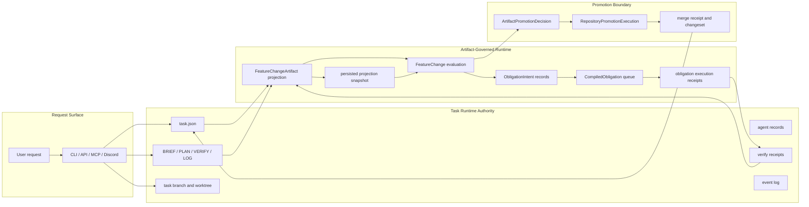
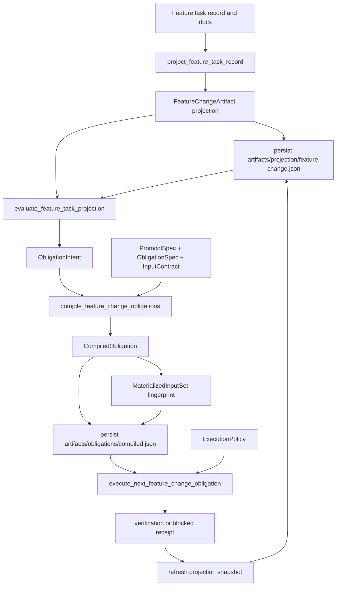
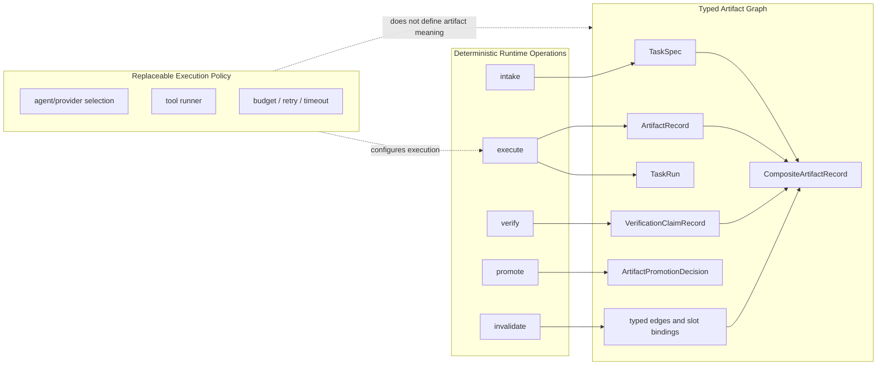
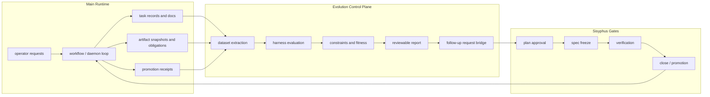
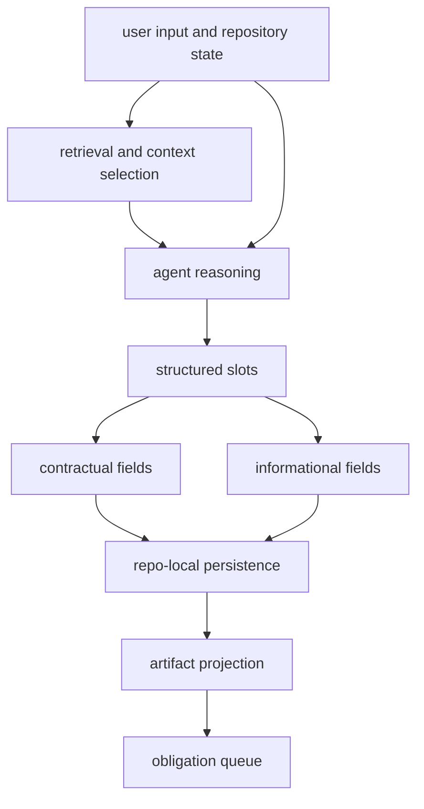
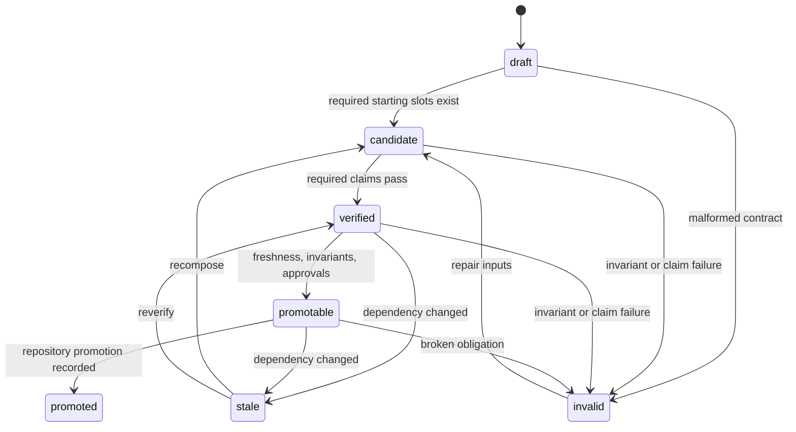
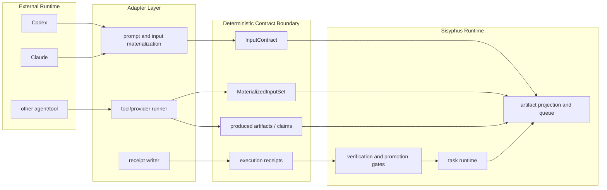

# Sisyphus Runtime Relationship Diagrams

This document complements [architecture.md](./architecture.md) with diagrams that make runtime boundaries explicit.

The main ambiguity to avoid is treating agent execution, task records, artifact projections, and repository promotion as one layer. They are related, but they have different authority.

The diagrams below split:

1. current runtime authority
2. artifact-governed feature-change path
3. target artifact authority
4. main and evolution loop
5. turn-to-contract materialization
6. artifact state machine
7. adapter contract boundary

## 1. Current Runtime Authority

The operator-facing control surface is still task-shaped. Feature work now also materializes artifact snapshots and compiled obligations.

## 2. Feature-Change Obligation Path

The DSL defines meaning. Execution policy defines how an obligation is run.

The important invariant is that a compiled obligation is keyed by its materialized input fingerprint. A changed input creates a new obligation instance rather than silently changing the meaning of an old verdict.

## 3. Target Artifact Authority

The intended long-term center is a typed artifact graph. Tasks remain operators, but they should not be the only durable source of truth.

## 4. Main And Evolution Loop

The main runtime is live and authoritative. Evolution is adjacent: it can read, evaluate, and request follow-up work, but it must route changes through Sisyphus lifecycle gates.

## 5. Turn-To-Contract Materialization

Agent reasoning may be stochastic. The persisted contract must be deterministic enough to replay.

Contractual fields are the governance boundary. Informational fields can help retrieval and review, but they must not weaken deterministic replay of the contract.

## 6. Artifact State Machine

The feature-change evaluator currently derives states through `promotable`. Repository merge and merge receipt recording are handled by the separate repository promotion execution path.

## 7. Adapter Contract Boundary

External agents should connect through a narrow adapter contract rather than owning Sisyphus state directly.

The adapter may vary by agent or provider. The contract boundary may not.
