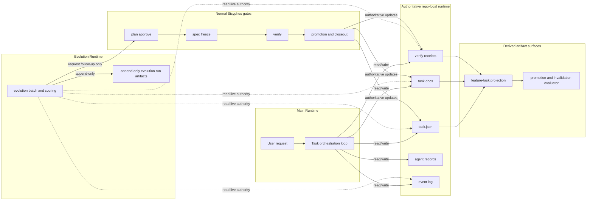
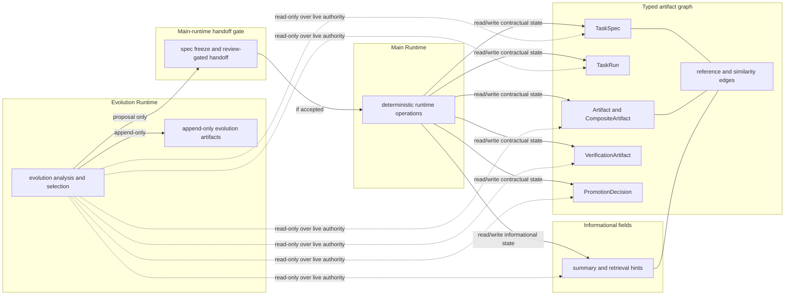
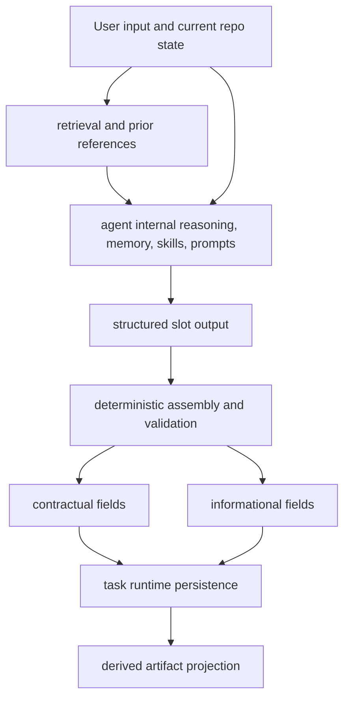
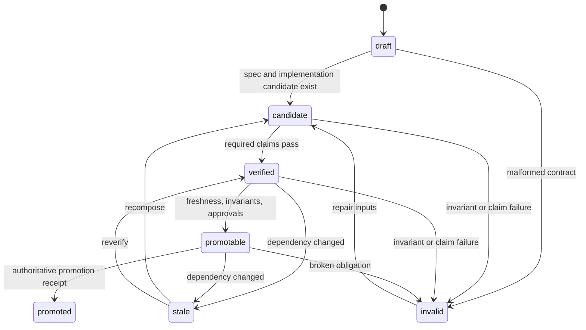
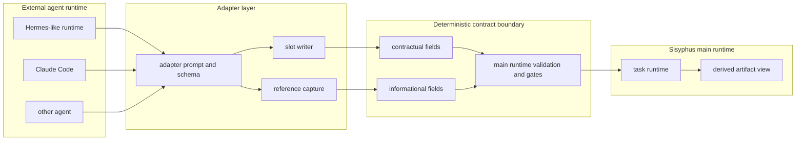

# Sisyphus Runtime Relationship Diagrams

This document complements [architecture.md](./architecture.md) with diagrams that separate the two concerns that are easy to conflate in prose:

- the current authoritative runtime vs the long-term artifact-centric target
- static authority boundaries vs dynamic time-based evolution flow

The diagrams below therefore split:

1. current runtime authority
2. target runtime authority
3. daily main/evolution loop
4. turn-to-arc materialization
5. artifact state machine
6. adapter contract boundary

## 1. Current Authority Map

This is the current implementation shape. The authoritative runtime is still task-shaped.

## 2. Target Authority Map

This is the intended direction. The center becomes a typed artifact graph rather than task records alone.

## 3. Daily Main and Evolution Loop

This is the time-based relationship. Main runtime is real-time; evolution runs as a separate batch.

```mermaid
flowchart LR
    subgraph DayT["Day T"]
        Requests[User requests]
        AgentT[agent version T]
        MainT[main runtime]
        ArtifactsT[task records, docs, receipts, events]
    end

    subgraph NightT["Night T batch"]
        ReadDay[read today's runtime traces]
        EvalNight[evolution fitness and selection]
        CandidateState[candidate agent state update]
        ReviewGate[review-gated promotion]
    end

    subgraph DayT1["Day T+1"]
        AgentT1[agent version T+1]
        MainT1[next main runtime day]
    end

    Requests --> AgentT
    AgentT --> MainT
    MainT --> ArtifactsT

    ArtifactsT --> ReadDay
    ReadDay --> EvalNight
    EvalNight --> CandidateState
    CandidateState --> ReviewGate
    ReviewGate --> AgentT1

    AgentT1 --> MainT1
```

## 4. Turn-to-Arc Flow

This is the contract boundary inside a single turn. The agent may be stochastic internally, but the contract layer must become deterministic.

Contractual fields are the governance boundary. Informational fields such as `summary` may help retrieval, but they must not weaken deterministic replay of the contract.

## 5. Artifact State Machine

This is the target artifact-state model. The current feature-task evaluator derives up to `promotable`; `promoted` remains reserved until it is backed by authoritative persisted state.

## 6. Adapter Contract Map

External agents should connect through a narrow adapter contract rather than owning Sisyphus state directly.

The adapter may vary by agent. The contract boundary may not.
