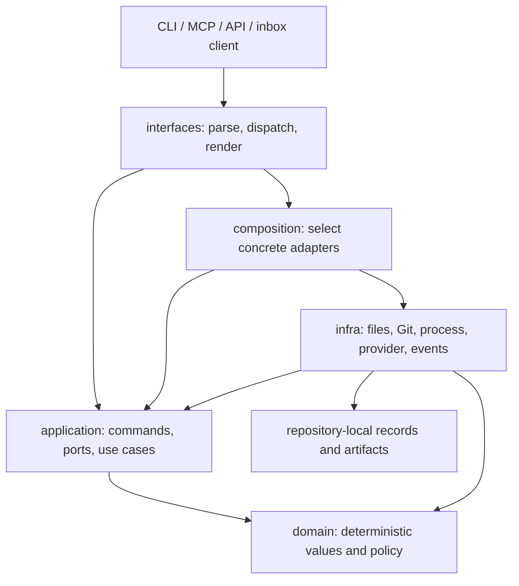
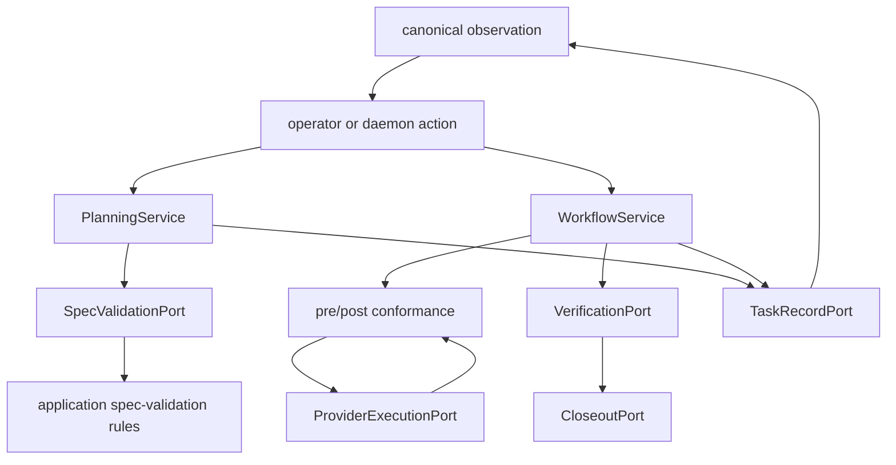
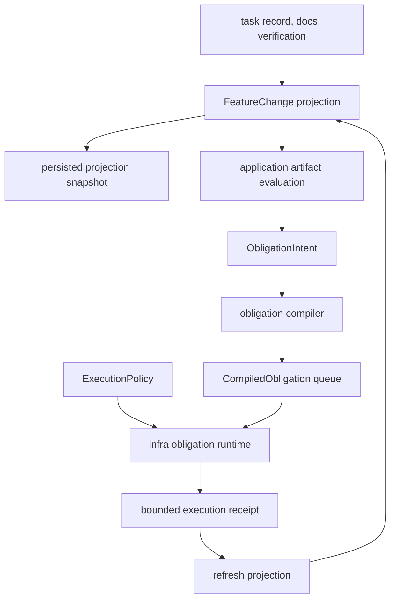
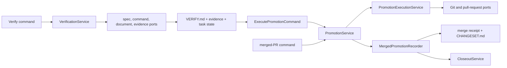
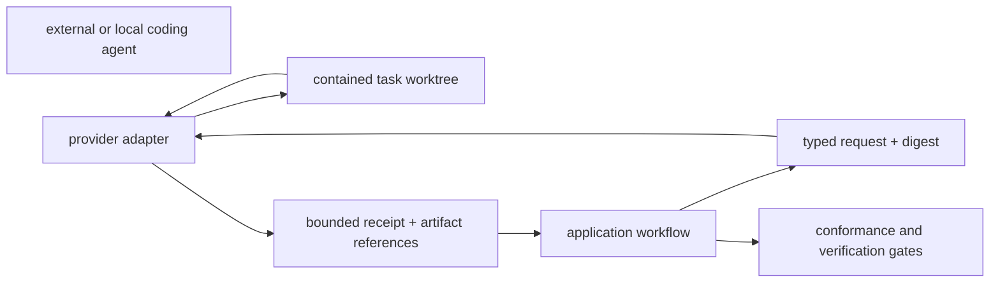
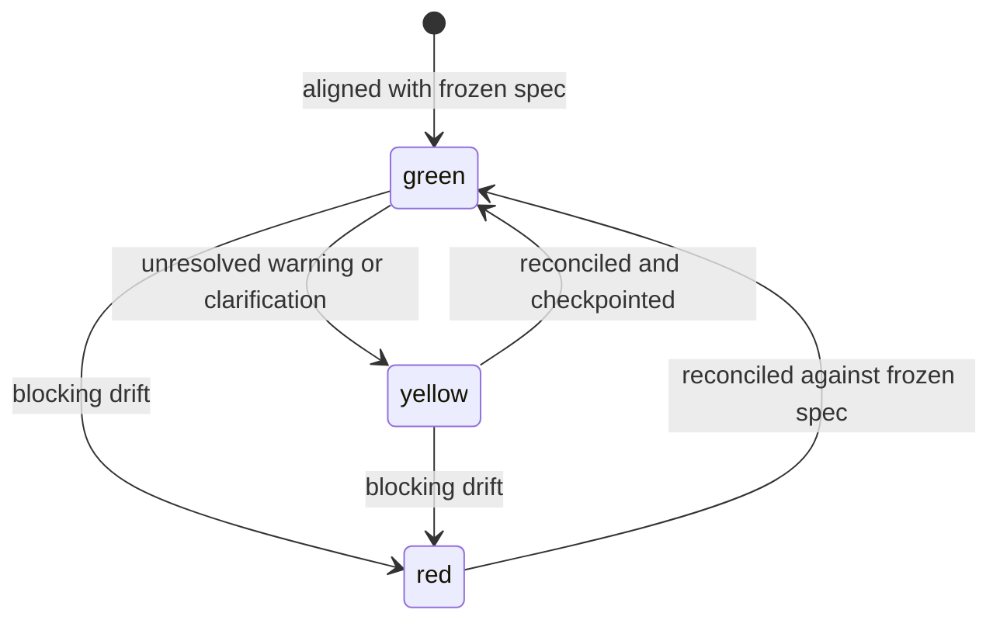

# Sisyphus Runtime Relationship Diagrams

Last verified against code: 2026-07-20

This document complements [architecture.md](./architecture.md) and
[architecture-and-data-pipeline.md](./architecture-and-data-pipeline.md). The
diagrams show implemented authority and dependency direction, not a future
service decomposition.

## 1. Dependency And Wiring Boundary

```mermaid
flowchart TB
    Client["CLI / MCP / API / inbox client"]
    Interface["interfaces: parse, dispatch, render"]
    Compose["composition: select concrete adapters"]
    UseCase["application: commands, ports, use cases"]
    Domain["domain: deterministic values and policy"]
    Adapter["infra: files, Git, process, provider, events"]
    Repository["repository-local records and artifacts"]

    Client --> Interface
    Interface --> Compose
    Interface --> UseCase
    Compose --> UseCase
    Compose --> Adapter
    UseCase --> Domain
    Adapter --> UseCase
    Adapter --> Domain
    Adapter --> Repository
```

The infrastructure arrows point inward because adapters implement
application-owned ports and consume domain values. Application services never
look up concrete adapters. Public compatibility facades delegate into interfaces
or composition and do not own policy.

## 2. Request To Task Record

```mermaid
sequenceDiagram
    autonumber
    actor User
    participant Surface as CLI / MCP / API
    participant Root as composition.repository_requests
    participant Request as RepositoryRequestService
    participant Queue as InboxQueueService
    participant Inbox as InboxRepository
    participant Process as InboxProcessingService
    participant Handler as ConversationEventService
    participant Create as TaskWorkspaceCreationService
    participant Store as TaskRecordPort

    User->>Surface: repository request
    Surface->>Root: parsed request
    Root->>Request: composed command
    Request->>Queue: validate and enqueue
    Queue->>Inbox: pending JSON record
    Request->>Process: process queued record
    Process->>Inbox: claim into processing
    Process->>Handler: strict parsed event
    Handler->>Create: create task and worktree
    Create->>Store: save canonical task record
    Process->>Inbox: complete or quarantine
```

The interface never writes `task.json` directly. Input is strictly parsed before
enqueue and after claim. Workspace creation and task persistence are ordered by
the application service, with rollback on template materialization failure.

## 3. Planning And Workflow Authority

```mermaid
flowchart TD
    Observation["canonical observation"]
    Action["operator or daemon action"]
    Planning["PlanningService"]
    Validation["SpecValidationPort"]
    Rules["application spec-validation rules"]
    Workflow["WorkflowService"]
    Conformance["pre/post conformance"]
    Provider["ProviderExecutionPort"]
    Verify["VerificationPort"]
    Close["CloseoutPort"]
    Record["TaskRecordPort"]

    Record --> Observation
    Observation --> Action
    Action --> Planning
    Planning --> Validation
    Validation --> Rules
    Action --> Workflow
    Workflow --> Conformance
    Conformance --> Provider
    Provider --> Conformance
    Workflow --> Verify
    Verify --> Close
    Planning --> Record
    Workflow --> Record
```

`task://<task-id>/observation` projects allowed and forbidden next actions. Plan
approval and spec freeze are operator gates. The workflow stops on review,
clarification, red conformance, failed execution, pending promotion, or retarget
requirements rather than reconstructing authority from an agent response.

## 4. Artifact And Obligation Path

```mermaid
flowchart TD
    Task["task record, docs, verification"]
    Project["FeatureChange projection"]
    Snapshot["persisted projection snapshot"]
    Evaluate["application artifact evaluation"]
    Intent["ObligationIntent"]
    Compile["obligation compiler"]
    Queue["CompiledObligation queue"]
    Policy["ExecutionPolicy"]
    Runtime["infra obligation runtime"]
    Receipt["bounded execution receipt"]
    Refresh["refresh projection"]

    Task --> Project
    Project --> Snapshot
    Project --> Evaluate
    Evaluate --> Intent
    Intent --> Compile
    Compile --> Queue
    Policy --> Runtime
    Queue --> Runtime
    Runtime --> Receipt
    Receipt --> Refresh
    Refresh --> Project
```

Artifact and DSL meanings are domain-owned. Projection, evaluation, obligation
identity, snapshot decisions, and execution-policy selection are application
policy. Infrastructure owns declarations and repository IO. A materialized-input
fingerprint is part of compiled obligation identity, so changed inputs cannot
silently reuse an earlier verdict.

## 5. Verification And Promotion

```mermaid
flowchart LR
    VerifyCommand["Verify command"]
    VerifyService["VerificationService"]
    VerifyPorts["spec, command, document, evidence ports"]
    VerifyReceipt["VERIFY.md + evidence + task state"]
    PromotionCommand["ExecutePromotionCommand"]
    PromotionFacade["PromotionService"]
    Execute["PromotionExecutionService"]
    GitHub["Git and pull-request ports"]
    MergeEvent["merged-PR command"]
    Recorder["MergedPromotionRecorder"]
    MergeReceipt["merge receipt + CHANGESET.md"]
    Close["CloseoutService"]

    VerifyCommand --> VerifyService
    VerifyService --> VerifyPorts
    VerifyPorts --> VerifyReceipt
    VerifyReceipt --> PromotionCommand
    PromotionCommand --> PromotionFacade
    PromotionFacade --> Execute
    Execute --> GitHub
    MergeEvent --> PromotionFacade
    PromotionFacade --> Recorder
    Recorder --> MergeReceipt
    Recorder --> Close
```

Verification owns gate and command ordering, while adapters execute bounded
effects. Promotion execution and merged-PR recording are distinct commands. A PR
URL is not a merge receipt, and closeout still checks evidence, conformance,
worktree, and promotion gates.

## 6. Main And Evolution Loops

```mermaid
flowchart LR
    subgraph Control["Authoritative Sisyphus control"]
        Requests["normal task request"]
        Plan["plan approval"]
        Freeze["spec freeze"]
        Agent["provider execution"]
        Verify["verification"]
        Promote["promotion and close"]
    end

    subgraph Evolution["Bounded Evolution context"]
        Dataset["read-only dataset projection"]
        Harness["effect-free evaluation plan"]
        Effects["isolated infra execution"]
        Fitness["constraints and fitness"]
        Report["append-only report"]
        Followup["request-only follow-up"]
    end

    Agent --> Dataset
    Verify --> Dataset
    Promote --> Dataset
    Dataset --> Harness
    Harness --> Effects
    Effects --> Fitness
    Fitness --> Report
    Report --> Followup
    Followup --> Requests
    Requests --> Plan
    Plan --> Freeze
    Freeze --> Agent
    Agent --> Verify
    Verify --> Promote
```

Evolution can observe, evaluate, score, report, and request. It cannot approve,
freeze, verify, activate, close, or promote. The control-side composition root
owns task creation and provider sequencing; Evolution effects remain in
`infra/evolution`.

## 7. External Agent Contract

```mermaid
flowchart LR
    External["external or local coding agent"]
    Adapter["provider adapter"]
    Request["typed request + digest"]
    Worktree["contained task worktree"]
    Receipt["bounded receipt + artifact references"]
    Application["application workflow"]
    Gates["conformance and verification gates"]

    Application --> Request
    Request --> Adapter
    Adapter --> Worktree
    Worktree --> Adapter
    Adapter --> Receipt
    Receipt --> Application
    Application --> Gates
```

An adapter may launch a different model or tool, but it never owns canonical
task state. Request/receipt digests, path containment, output limits, deadlines,
and verification gates form the deterministic boundary around stochastic agent
execution.

## 8. Conformance Colors

```mermaid
stateDiagram-v2
    [*] --> green: aligned with frozen spec
    green --> yellow: unresolved warning or clarification
    yellow --> green: reconciled and checkpointed
    green --> red: blocking drift
    yellow --> red: blocking drift
    red --> green: reconciled against frozen spec
```

- `green` permits progression when all other lifecycle gates pass.
- `yellow` blocks final verification and close until resolved.
- `red` stops execution until drift is reconciled.

These colors are policy outcomes shared by observation, workflow, and Evolution
projections. They are not presentation-only status labels.
