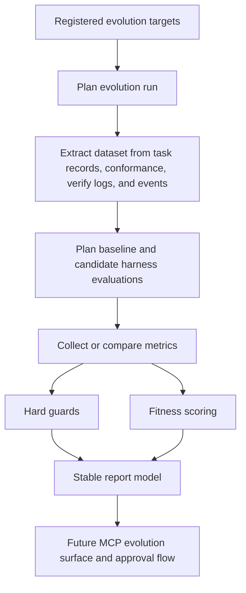

# Sisyphus Self-Evolution Plan via MCP

This document is the handoff plan for the next Codex run.

The intent is to use **Sisyphus through MCP** as the control plane for the remaining work, instead of continuing with direct file-first operation.

## Goal

Add a **self-evolution subsystem** to Sisyphus, inspired by `NousResearch/hermes-agent-self-evolution`, but shaped for Sisyphus architecture:

- Sisyphus remains the orchestration/runtime system.
- Evolution runs are handled as a separate control plane.
- MCP is the shared interface for Codex, Claude, and future clients.
- Event bus, conformance state, and task records become the evaluation trace source.

## Current State

The following foundation work is already in place in this repository:

- conformance model with `green / yellow / red`
- conformance logs and persistence
- event bus abstraction and JSONL publisher
- MCP gateway/core split
- MCP resources for:
  - repository task status
  - conformance board
  - status board
  - event feed
  - task timeline
  - MCP schema reference
- architecture and MCP client documentation

These are the key files already added or updated:

- [docs/architecture.md](./architecture.md)
- [docs/mcp-clients.md](./mcp-clients.md)
- [src/taskflow/conformance.py](../src/taskflow/conformance.py)
- [src/taskflow/bus.py](../src/taskflow/bus.py)
- [src/taskflow/bus_jsonl.py](../src/taskflow/bus_jsonl.py)
- [src/taskflow/events.py](../src/taskflow/events.py)
- [src/taskflow/mcp_core.py](../src/taskflow/mcp_core.py)
- [src/taskflow/mcp_server.py](../src/taskflow/mcp_server.py)

## Implemented Foundation

The repository now includes the first read-only evolution foundation:

- `targets.py` and `runner.py` for target selection and run planning
- `dataset.py` for trace extraction from repository-local task and event state
- `harness.py` for baseline/candidate evaluation planning
- `constraints.py` and `fitness.py` for hard guards and weighted scoring
- `report.py` for stable review/report projection

The remaining major gaps are still candidate mutation, executed harness runs, MCP evolution tools/resources, and approval-driven branch materialization.

### Implemented Evaluation Loop



This is intentionally separate from the live task workflow. The evolution subsystem currently models and evaluates candidate runs from repository-local traces without mutating live task state.

## Constraint

The previous session could not use Sisyphus over MCP because Codex did not complete the external MCP stdio handshake in that environment.

The next run should assume:

- Sisyphus MCP is connected and available
- Codex should prefer MCP resources/tools first
- direct code inspection/editing should follow only after MCP state has been read

## Design Direction

Hermes-style self-evolution should **not** be embedded directly into the live workflow loop.

The correct architecture for Sisyphus is:

```text
MCP clients
  -> Sisyphus MCP gateway
  -> evolution control plane
  -> harness / evaluator / report generator
  -> branch / PR proposal
```

Runtime orchestration and self-evolution must remain separate.

## Target Scope

The first implementation scope should be narrow and safe.

### Phase 1 Targets

Only evolve text/policy assets first:

- execution contract wording
- MCP tool descriptions
- agent instruction sections
- conformance summary wording
- review / gate explanation text

### Phase 2 Targets

- planner prompt fragments
- subtask generation guidance
- verify/conformance operator policy wording

### Phase 3 Targets

- selected non-critical code paths
- summary/projection logic
- report generation logic

### Phase 4 Targets

- deeper orchestration logic only after harness quality is proven

## Required New Modules

Create a new evolution package:

```text
src/taskflow/evolution/
  targets.py
  dataset.py
  mutators.py
  harness.py
  fitness.py
  constraints.py
  report.py
  runner.py
```

### Responsibility Split

- `targets.py`
  - declares what can be evolved
- `dataset.py`
  - builds evaluation sets from task records, events, conformance history, verify logs
- `mutators.py`
  - generates candidate prompt/policy/code variants
- `harness.py`
  - runs baseline vs candidate on the same dataset
- `fitness.py`
  - computes scores
- `constraints.py`
  - enforces hard guards
- `report.py`
  - emits comparison reports
- `runner.py`
  - orchestrates a single evolution run

## Harness Requirements

The harness is the most important part.

Every candidate should be evaluated against a baseline using the same task set.

### Minimum Metrics

- verify pass rate
- conformance color outcome
- drift count
- unresolved warning count
- runtime
- token or cost estimate if available
- operator reviewability

### Hard Guards

Reject a candidate if any of the following is true:

- verify pass rate drops
- `red` drift increases
- unresolved warnings increase beyond accepted threshold
- MCP compatibility breaks
- output/schema contract changes unintentionally
- semantic intent drifts from original target

### Execution Isolation

Do not run candidate evaluation against live task state.

Use:

- branch snapshots
- task/worktree copies
- isolated evaluation runs

## MCP Surface To Add

The next implementation pass should expose evolution through MCP.

### Tools

- `sisyphus.evolution_start`
  - start a new evolution run
- `sisyphus.evolution_status`
  - fetch run status
- `sisyphus.evolution_compare`
  - compare baseline and best candidate
- `sisyphus.evolution_approve`
  - approve a candidate
- `sisyphus.evolution_branch`
  - materialize approved result on a branch

### Resources

- `repo://status/evolution`
  - current evolution run board
- `evolution://<run-id>/report`
  - human-readable run report
- `evolution://<run-id>/dataset`
  - evaluation set metadata
- `evolution://<run-id>/candidates`
  - candidate summaries and scores

## Next-Run MCP Workflow

When Codex is restarted and Sisyphus MCP is connected, the work should proceed in this order.

### 1. Inspect MCP state first

Read these resources before planning edits:

- `repo://schema/mcp`
- `repo://status/board`
- `repo://status/conformance`
- `repo://status/events`

### 2. Inspect current task state

If a task already exists for self-evolution work:

- read `task://<task-id>/record`
- read `task://<task-id>/conformance`
- read `task://<task-id>/timeline`

If no task exists:

- use `sisyphus.request_task`
- create a feature task for `self-evolution control plane`

### 3. Move task through Sisyphus lifecycle

Use Sisyphus tools instead of editing task status directly:

- approve plan
- freeze spec
- generate subtasks
- verify
- close only when verified

### 4. Implement in this order

#### Workstream A. Evolution architecture

- add `src/taskflow/evolution/`
- define run model and target registry
- document evaluation flow

#### Workstream B. Dataset builder

- mine task records
- mine conformance history
- mine event bus JSONL
- define eval example schema

#### Workstream C. Harness

- baseline vs candidate runner
- isolated task/worktree execution
- result capture

#### Workstream D. Fitness and constraints

- scoring rules
- rejection rules
- semantic and compatibility checks

#### Workstream E. MCP evolution interface

- add tools
- add resources
- add status/report projection

#### Workstream F. Reporting

- report generator
- branch proposal output
- human approval path

## Suggested Task Breakdown

These should become Sisyphus subtasks in the next run:

1. `evolution-core`
   - add run model, target registry, runner skeleton
2. `evolution-dataset`
   - build dataset extraction from task/event/conformance sources
3. `evolution-harness`
   - implement baseline/candidate evaluation runner
4. `evolution-fitness`
   - implement scoring and hard constraints
5. `evolution-mcp-surface`
   - expose evolution tools/resources over MCP
6. `evolution-reporting`
   - generate compare/report outputs and branch proposal metadata

## Acceptance Criteria

The first self-evolution milestone is complete when:

- a target can be selected from a registry
- a dataset can be generated from existing Sisyphus traces
- baseline and candidate can both run through the harness
- a score and constraint result can be produced
- a report is stored and exposed over MCP
- no live task state is mutated during evaluation
- approval is required before branch materialization

## Guidance For The Next Codex Run

Use Sisyphus MCP as the source of truth before editing code.

Preferred order:

1. read schema and board resources
2. locate or create the self-evolution task
3. progress the task via Sisyphus tools
4. implement the evolution subsystem in small slices
5. update conformance and verify state through normal Sisyphus flow

Do not bypass Sisyphus task state manually unless MCP is still unavailable.
