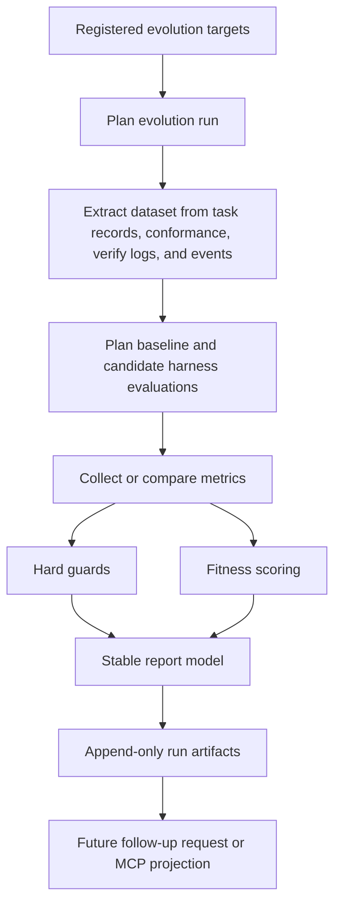

# Sisyphus Self-Evolution Plan via MCP

This document is the handoff plan for the next Codex run.

The intent is to use **Sisyphus through MCP** as the control plane for the remaining work, instead of continuing with direct file-first operation.

## Goal

Add a **self-evolution subsystem** to Sisyphus, inspired by `NousResearch/hermes-agent-self-evolution`, but shaped for Sisyphus architecture:

- Sisyphus remains the orchestration/runtime system.
- Evolution runs are handled as a separate control plane.
- MCP is the shared interface for Codex, Claude, and future clients.
- Event bus, conformance state, and task records become the evaluation trace source.

## Current State

The following foundation work is already in place in this repository:

- conformance model with `green / yellow / red`
- conformance logs and persistence
- event bus abstraction and JSONL publisher
- MCP gateway/core split
- MCP resources for:
  - repository task status
  - conformance board
  - status board
  - event feed
  - task timeline
  - MCP schema reference
- architecture and MCP client documentation

These are the key files already added or updated:

- [docs/architecture.md](./architecture.md)
- [docs/mcp-clients.md](./mcp-clients.md)
- [src/sisyphus/conformance.py](../src/sisyphus/conformance.py)
- [src/sisyphus/bus.py](../src/sisyphus/bus.py)
- [src/sisyphus/bus_jsonl.py](../src/sisyphus/bus_jsonl.py)
- [src/sisyphus/events.py](../src/sisyphus/events.py)
- [src/sisyphus/mcp_core.py](../src/sisyphus/mcp_core.py)
- [src/sisyphus/mcp_server.py](../src/sisyphus/mcp_server.py)

## Implemented Foundation

The repository now includes the first read-only evolution foundation:

- `targets.py` and `runner.py` for target selection, run planning, and request/result contracts
- `stages.py` for the read-only stage machine and stage-aware failure contract
- `artifacts.py` for the minimum evolution artifact-cycle types
- `handoff.py` for the reviewable follow-up payload and no-self-approval boundary
- `dataset.py` for trace extraction from repository-local task and event state
- `harness.py` for baseline/candidate evaluation planning, deterministic summary fallback execution, bounded isolated Sisyphus evaluation requests, and full worktree-backed command execution with structured receipts
- `materialization.py` for bounded baseline/candidate snapshot preparation inside isolated evaluation worktrees
- `constraints.py` and `fitness.py` for hard guards and weighted scoring
- `report.py` for stable review/report projection
- `orchestrator.py` for `execute_evolution_run(...)` and append-only run artifact persistence

The remaining major gaps are MCP/CLI evolution ingress, review-gated Sisyphus follow-up execution, and promotion/invalidation recording.

### Implemented Evaluation Loop



This is intentionally separate from the live task workflow. The evolution subsystem currently models and evaluates candidate runs from repository-local traces without mutating live task state. `execute_evolution_run(...)` may write only under `.planning/evolution/runs/<run_id>/`.

## Constraint

The previous session could not use Sisyphus over MCP because Codex did not complete the external MCP stdio handshake in that environment.

The next run should assume:

- Sisyphus MCP is connected and available
- Codex should prefer MCP resources/tools first
- direct code inspection/editing should follow only after MCP state has been read

## Design Direction

Hermes-style self-evolution should **not** be embedded directly into the live workflow loop.

The correct architecture for Sisyphus is:

```text
MCP clients
  -> Sisyphus MCP gateway
  -> evolution control plane
  -> read-only planning / scoring / report generation
  -> future follow-up request
  -> normal Sisyphus lifecycle for any real execution
```

Runtime orchestration and self-evolution must remain separate.

The stronger version of that rule is:

- Sisyphus owns the authoritative runtime contract and durable work graph
- Hermes-like capabilities may be absorbed as planning, decomposition, or recovery intelligence
- those capabilities must not become the source of truth for receipts, artifact relations, verification, promotion, or invalidation

In other words, intelligence is allowed to operate on the work world, but authority must remain inside Sisyphus.

## Target Scope

The first implementation scope should be narrow and safe.

### Phase 1 Targets

Only evolve text/policy assets first:

- execution contract wording
- MCP tool descriptions
- agent instruction sections
- conformance summary wording
- review / gate explanation text

### Phase 2 Targets

- planner prompt fragments
- subtask generation guidance
- verify/conformance operator policy wording

### Phase 3 Targets

- selected non-critical code paths
- summary/projection logic
- report generation logic

### Phase 4 Targets

- deeper orchestration logic only after harness quality is proven

## Current Module Surface

The current implementation surface is:

```text
src/sisyphus/evolution/
  targets.py
  dataset.py
  harness.py
  materialization.py
  fitness.py
  constraints.py
  report.py
  runner.py
  stages.py
  artifacts.py
  handoff.py
  orchestrator.py
```

These modules currently provide planning, scoring, contract vocabulary, append-only run persistence, bounded candidate materialization, and full worktree-backed evaluation execution inside isolated evaluation worktrees. They do not yet include live follow-up task creation, promotion recording, or MCP ingress.

## Planned Additions

The following additions are planned but are not fully implemented today:

- evolution-to-Sisyphus follow-up bridge
- promotion and invalidation envelopes
- CLI and MCP surfaces for `run`, `status`, `report`, and `compare`

## Harness Requirements

The harness is the most important part.

Every candidate should be evaluated against a baseline using the same task set.

### Minimum Metrics

- verify pass rate
- conformance color outcome
- drift count
- unresolved warning count
- runtime
- token or cost estimate if available
- operator reviewability

### Hard Guards

Reject a candidate if any of the following is true:

- verify pass rate drops
- `red` drift increases
- unresolved warnings increase beyond accepted threshold
- MCP compatibility breaks
- output/schema contract changes unintentionally
- semantic intent drifts from original target

### Execution Isolation

Do not run candidate evaluation against live task state.

Use:

- branch snapshots
- task/worktree copies
- isolated evaluation runs

## MCP Surface To Add Later

The next implementation pass should expose evolution through MCP, but only after the run artifact cycle and handoff contract are fixed.

### Tools

- `sisyphus.evolution_run`
  - start a new evolution run
- `sisyphus.evolution_status`
  - fetch run status
- `sisyphus.evolution_report`
  - fetch the reviewable report for a run
- `sisyphus.evolution_compare`
  - compare baseline and candidate results

The system should not expose approval or branch-materialization tools until receipts and promotion envelopes exist.

### Resources

- `evolution://<run-id>/report`
  - human-readable run report
- `evolution://<run-id>/dataset`
  - evaluation set metadata
- `evolution://<run-id>/status`
  - run stage and failure status
- `evolution://<run-id>/compare`
  - candidate summaries and scores

## Next-Run MCP Workflow

When Codex is restarted and Sisyphus MCP is connected, the work should proceed in this order.

### 1. Inspect MCP state first

Read these resources before planning edits:

- `repo://schema/mcp`
- `repo://status/board`
- `repo://status/conformance`
- `repo://status/events`

### 2. Inspect current task state

If a task already exists for self-evolution work:

- read `task://<task-id>/record`
- read `task://<task-id>/conformance`
- read `task://<task-id>/timeline`

If no task exists:

- use `sisyphus.request_task`
- create a feature task for `self-evolution control plane`

### 3. Move task through Sisyphus lifecycle

Use Sisyphus tools instead of editing task status directly:

- approve plan
- freeze spec
- generate subtasks
- verify
- close only when verified

### 4. Implement in this order

#### Workstream A. Contract alignment

- keep current behavior separate from near-next scaffolding
- document the read-only planning and scoring slice
- preserve the no-self-approval boundary

#### Workstream B. Read-only orchestration

- persist run-local artifacts under `.planning/evolution/runs/<run_id>/`
- orchestrate run planning, dataset building, harness planning, constraints, fitness, and report generation

#### Workstream C. Isolated evaluation executor

- materialize baseline and candidate snapshots
- run the evaluation harness in isolated worktrees or copies
- capture results, metrics, and evidence without touching live task state

#### Workstream D. Sisyphus bridge

- convert reviewed evolution output into a Sisyphus follow-up task request
- preserve plan review, approval policy, spec freeze, verify, and receipt gates

#### Workstream E. Surface and projection

- add CLI and MCP status/report/compare surfaces
- expose append-only run artifacts through stable views

#### Workstream F. Promotion and invalidation

- record promotion candidates and invalidation decisions as evidence-backed envelopes
- connect follow-up execution receipts and verification artifacts back to the original evolution run

## Suggested Task Breakdown

These should become Sisyphus subtasks in the next run:

1. `freeze-evolution-authority-boundary-and-safety-rules`
   - lock the execution authority boundary
2. `align-evolution-contract-and-doc-reality`
   - keep contract names and docs aligned to real behavior
3. `define-evolution-artifact-cycle-interface`
   - define the minimum artifact vocabulary for the next slices
4. `define-evolution-stage-transition-and-failure-contract`
   - freeze the stage model and failure payloads
5. `define-evolution-to-sisyphus-handoff-payload`
   - define the reviewable follow-up request contract
6. `implement-execute-evolution-run-read-only-orchestrator`
   - wire the current planning and scoring slices into an append-only run flow

## Acceptance Criteria

The first self-evolution milestone is complete when:

- a target can be selected from a registry
- a dataset can be generated from existing Sisyphus traces
- baseline and candidate evaluation can be planned and, later, executed in an isolated harness
- a score and constraint result can be produced
- a report is stored as a run artifact
- no live task state is mutated during evaluation
- approval is required before any follow-up execution or branch materialization

## Guidance For The Next Codex Run

Use Sisyphus MCP as the source of truth before editing code.

Preferred order:

1. read schema and board resources
2. locate or create the self-evolution task
3. progress the task via Sisyphus tools
4. implement the evolution subsystem in small slices
5. update conformance and verify state through normal Sisyphus flow

Do not bypass Sisyphus task state manually unless MCP is still unavailable.
